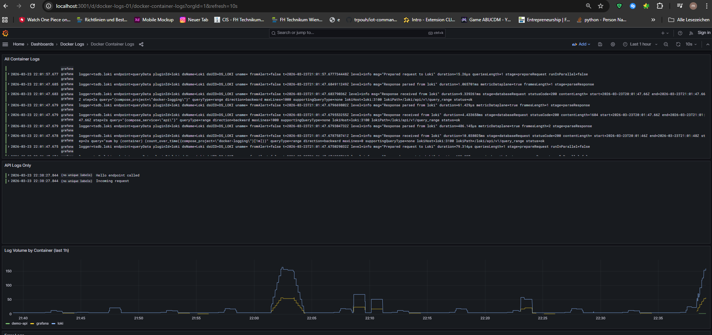

# Docker Logging Stack — Promtail · Loki · Grafana




A complete, zero-config logging pipeline for a local Docker host.

```
Demo API (stdout JSON logs)
        │
        ▼ Docker json-file driver
   /var/run/docker.sock
        │
        ▼
    Promtail  (scrapes Docker socket, ships to Loki)
        │
        ▼
      Loki    (indexes & stores logs)
        │
        ▼
    Grafana   (visualises logs at http://localhost:3001)
```

---

## Quick Start

```bash
# 1. Clone / enter the project folder
cd docker-logging

# 2. Build and start everything
docker compose up -d --build

# 3. Verify all four containers are running
docker compose ps
```


## Generate Log Messages

Hit the demo API endpoints to create log traffic:

```bash
# Info log on every call
curl http://localhost:3000/

# Info log with a name parameter
curl http://localhost:3000/hello/Alice

# Simulated ERROR log  (level=error in Loki)
curl http://localhost:3000/error

# Simulated WARNING log
curl http://localhost:3000/warn

# Health check (debug log)
curl http://localhost:3000/health
```

Each request writes a structured JSON line to stdout, for example:

```json
{"timestamp":"2024-03-01T12:00:00.000Z","level":"info","message":"Incoming request","method":"GET","path":"/hello/Alice","ip":"::ffff:172.20.0.1"}
```

---

## View Logs in Grafana

1. Open **http://localhost:3001** in your browser (no login required).
2. Navigate to **Dashboards → Docker Logs → Docker Container Logs**.
3. The dashboard contains four pre-built panels:
   - **All Container Logs** — every container in the stack
   - **API Logs Only** — filtered to the `api` service
   - **Log Volume by Container** — time-series count per container
   - **Error Logs** — filtered to `level=error`

---

## Verification Checklist

| Step | How to verify |
|---|---|
| API is running | `curl http://localhost:3000/` → `{"status":"ok"}` |
| Loki is healthy | `curl http://localhost:3100/ready` → `ready` |
| Logs reach Loki | `curl 'http://localhost:3100/loki/api/v1/labels'` → includes `container`, `compose_service` |
| Logs visible in Grafana | Dashboard "Docker Container Logs" shows entries |

---

## File Structure

```
docker-logging/
├── docker-compose.yml            
├── app/
│   ├── Dockerfile
│   ├── index.js                    # Express API with structured logging
│   └── package.json
├── promtail/
│   └── config.yml                  # Docker socket scrape config
├── loki/
│   └── config.yml                  # Loki storage / schema config
└── grafana/
    └── provisioning/
        ├── datasources/
        │   └── loki.yml            # Auto-wires Loki as default datasource
        └── dashboards/
            ├── provider.yml        # Tells Grafana where to load dashboards from
            └── docker-logs.json    # Pre-built dashboard
```

## Explanation of the Stack
**demo-api** is a small Node.js/Express app you built. Every time you hit an endpoint like GET /hello/Alice, it calls console.log() with a structured JSON object — timestamp, level, message. That's it. Writing to stdout is all it needs to do. Docker intercepts everything a container prints to stdout and saves it as log files on your host machine in a format called json-file (the default log driver). This is key — the app itself knows nothing about Promtail or Loki.

**Promtail** is the log collector. It mounts /var/run/docker.sock — the Unix socket that gives it read access to the Docker daemon — and uses that to discover every running container automatically (this is called service discovery). Every 5 seconds it checks for new containers and starts tailing their logs. When it finds new log lines it runs them through a pipeline: it tries to parse each line as JSON, and if it succeeds, it promotes fields like level into Loki labels. Then it ships the logs over HTTP to Loki. Promtail itself doesn't store anything.

**Loki** is the log database. It receives log streams from Promtail, indexes them by their labels (container, compose_service, level, etc.), and stores the raw log lines compressed on disk in the loki_data named volume. The indexing is what makes fast queries possible — when Grafana asks "show me all error logs from demo-api", Loki uses the labels to find the right chunks without scanning everything. Loki speaks a query language called LogQL.

**Grafana** is the UI. It has the Loki datasource pre-configured (via the provisioning files in grafana/provisioning/), which means on startup it automatically knows where Loki is and how to talk to it. When you open a dashboard or the Explore view and run a query, Grafana sends that LogQL query to Loki over the internal logging network, gets the results back, and renders them.


## Troubleshooting

**Promtail exits immediately on Linux:**
```bash
# Grant access to Docker socket
sudo chmod 666 /var/run/docker.sock
# or add your user to the docker group and re-login
sudo usermod -aG docker $USER
```

**No logs appear in Grafana:**
- Wait ~15 seconds after first requests for Promtail to scrape and Loki to index.
- Check Promtail logs: `docker compose logs promtail`
- Verify Loki received data: `curl 'http://localhost:3100/loki/api/v1/label/container/values'`
